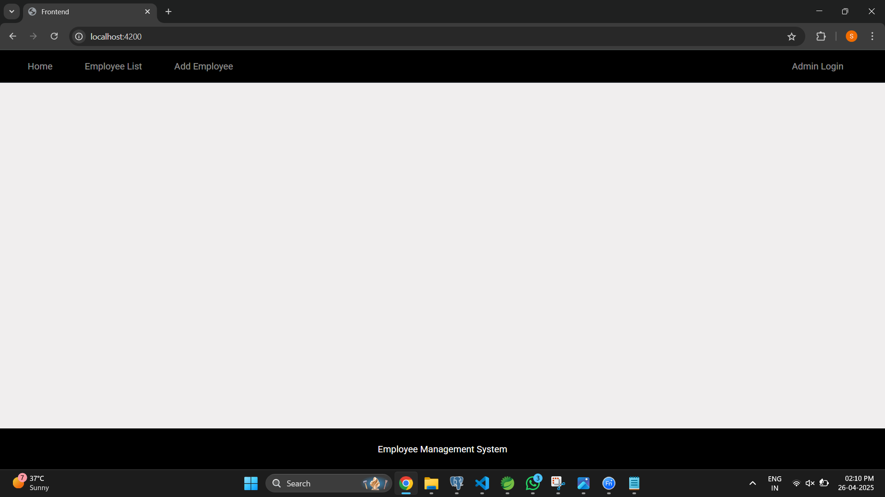

# Employee CRUD Project

The Employee CRUD Project is used to manage employee details and it performs CRUD operation lile Add Employee, Update Employee, View Employee, Delete Employee.

It includes technology stack :

1) For Backend :
   • Spring Tool Suit : I have used Spring.io and Spring Tool Suit as a backend.
                        I have created a basic project of Employee CRUD on Spring.io,
                        and then after creating project I opened it in Spring Tool Suit,
                        then created many different packages :
   
                        • com.example.demo : Class : EmpBackendApplication
                        • com.example.demo.adminController : Class : adminController
                        • com.example.demo.adminModel : Class : adminModel
                        • com.example.demo.adminRepository : Class : adminRepository
                        • com.example.demo.controller : Class : EmployeeController
                        • com.example.demo.exception : Class : ResourceNotFoundException
                        • com.example.demo.model : Class :  Employee.java
                        • com.example.demo.repository : Class : EmployeeRepository
                        • com.example.demo.webconfig : Class : webconfig

  • After creating packages and classes , I updated the project and Run as Spring Boot App.
  •Now Backend Run Successfully.
                        
2) For Frontend :
  • Angular (VSCODE) : For frontend I have used VSCODE for Angular :
                       In VSCODE I have Angular project named as employee-crud-frontend

                      • ng new employee-crud-frontend
                      • cd employee-crud-frontend
                      • npm install bootstrap
                      • ng generate component add-employee
                      • ng generate component admin-login
                      • ng generate component employee-list
                      • ng generate component home
                      • ng generate component show-details
                      • ng generate component update-employee
                      • ng generate service employee
   • And after doing all necessary procedures to create Frontend Project then I used this command to run Project :

                      • ng serve

   # Employee CRUD Project :

   

                       
